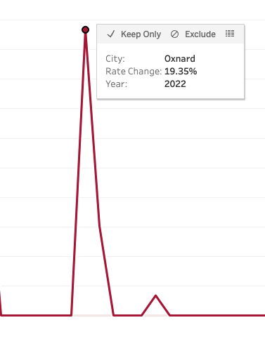
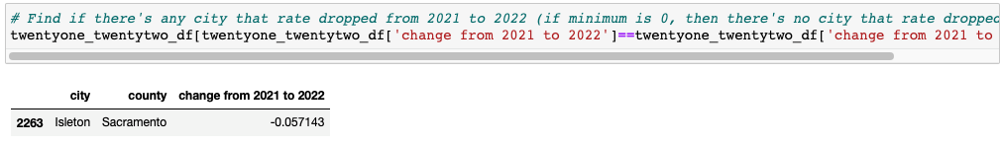

# CA_Sales_Tax_Analysis

## Overview of the Sales Tax Analysis
The purpose of this project is to analyze the change in sales tax rates from 2020 to 2022 for cities in California. Because sales tax rates are updated quarterly, I collected the sales tax rate data for 1Q2020, 1Q2021, and 1Q2022 from CDTFA (California Department of Tax and Fee Administration) to compare the rates from 2020 to 2022. After I collected the data, I cleaned them using Excel and Pandas. Then, I used MySQL to create tables for each year and join them to create one table, SalesTaxByYear. With combined table, I used Pandas to find rate change from 2020 to 2021 and 2021 to 2022 for each city, find cities that have the highest sales tax rate in 2022, find cities that have the lowest sales tax rate in 2022, and find cities that have the highest rate change and the lowest rate change from 2020 to 2021 and 2021 to 2022. Finally, I used Tableau to create various visualizations to effectively show my findings. 
https://www.cdtfa.ca.gov/taxes-and-fees/archive-rates.htm

## Results
- Cities that have the highest sales tax rate in 2022

As shown on the above, 8 cities in Alameda county have the highest sales tax rate in 2022, which is 10.75%. 

[Tableau Link](https://public.tableau.com/app/profile/ayoung.kim2278/viz/CitiesinCAthathavehighestsalestaxratein2022/HighestSalesTaxRate)

- Cities that have the lowest sales tax rate in 2022

As shown on the above, there are 441 cities that have the lowest sales tax rate in 2022, which is 7.25%. 

[Tableau Link](https://public.tableau.com/app/profile/ayoung.kim2278/viz/CitiesinCAthathavelowestsalestaxratein2022/LowestSalesTaxRate)

- Cities that have highest rate change from 2020 to 2021

As shown on the above, the sales tax rate for two cities, Blythe and Lompoc, increased the most from 2020 to 2021. -- increased by 12.90%

- Cities that have highest rate change from 2021 to 2022

As shown on the above, the sales tax rate for two cities, Los Alamitos and Oxnard, increased the most from 2021 to 2022. -- increased by 19.35%

- Cities where rate dropped from 2020 to 2021

As shown on the above, the lowest sales tax rate change from 2020 to 2021 is 0%, which indicates that there were no cities that sales tax rate dropped from 2020 to 2021. 

- Cities where rate dropped from 2021 to 2022

As shown on the above, the sales tax rate for one city, Isleton, dropped by 5.71% from 2021 to 2022. 

- [Graph showing sales tax rate change from 2020 to 2022](https://public.tableau.com/app/profile/ayoung.kim2278/viz/CASalesTaxRateChangefrom2020to2022/CASalesTaxRateChange2020-2022)

- [Graph showing sales tax rate from 2020 to 2022](https://public.tableau.com/app/profile/ayoung.kim2278/viz/CASalesTaxRatefrom2020to2022/Sheet1)
	

  

